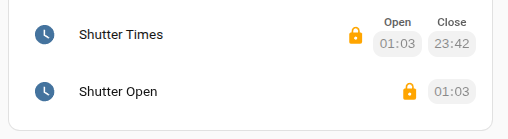

# Pill Time Input Row

A modern, Tile-card styled replacement for the default `input_datetime` row in Home Assistant. Designed specifically for use inside the **Entities Card**.

## Features
- **Pill Aesthetic**: Matches the modern Home Assistant "Tile" card look.
- **Editing of the time**: The time can be directly edited.
- **Locking Support**: Includes a lock toggle for security-sensitive selections.
- **Theme Native**: Automatically inherits your Home Assistant theme colors.
- **Two Times**: Allows two times to be shown; simple display of a start and a stop time.

## Installation

### HACS (Recommended)
1. Open **HACS** in Home Assistant.
2. Go to **Frontend**.
3. Click the **3-dot menu** in the top right and select **Custom repositories**.
4. Paste `https://github.com/ddpurdie/pill-time-input-row` into the URL and select **Plugin** as the category.
5. Click **Install**.

## Configuration
Add it to your Entities card like any other row:

### Configuration items

| Name             | Type         | Default                     | Description                                                        |
| ---------------- | ------------ | --------------------------- | ------------------------------------------------------------------ |
| entity           | string       |                             | A valid input_select entity_id                                     |
| name             | string/bool  | `friendly_name`             | Override entity friendly name (or `false` to hide)                 |
| icon             | string       |                             | Override the entities default icon                                 |
| locked           | bool         | `false`                     | When true, prevent the times from being modified. Will show lock symbol. The selection can be enabled by tapping the lock indicator |
| header           | string       |                             | A title for the time element. Placed above the displayed time     |
| entity2          | string       |                             | A valid input_select entity_id to display a second time.          |
| header2          | string       |                             | A title for the secondtime element. Placed above the displayed time     |


## Example



```yaml
type: entities
entities:
  - entity: input_datetime.shutteropen
    type: custom:pill-time-input-row
    name: Shutter Times
    locked: true
    header: Open
    entity2: input_datetime.shutterclose
    header2: Close
  - entity: input_datetime.shutteropen
    type: custom:pill-time-input-row
    name: Shutter Open
    locked: true
```

   

